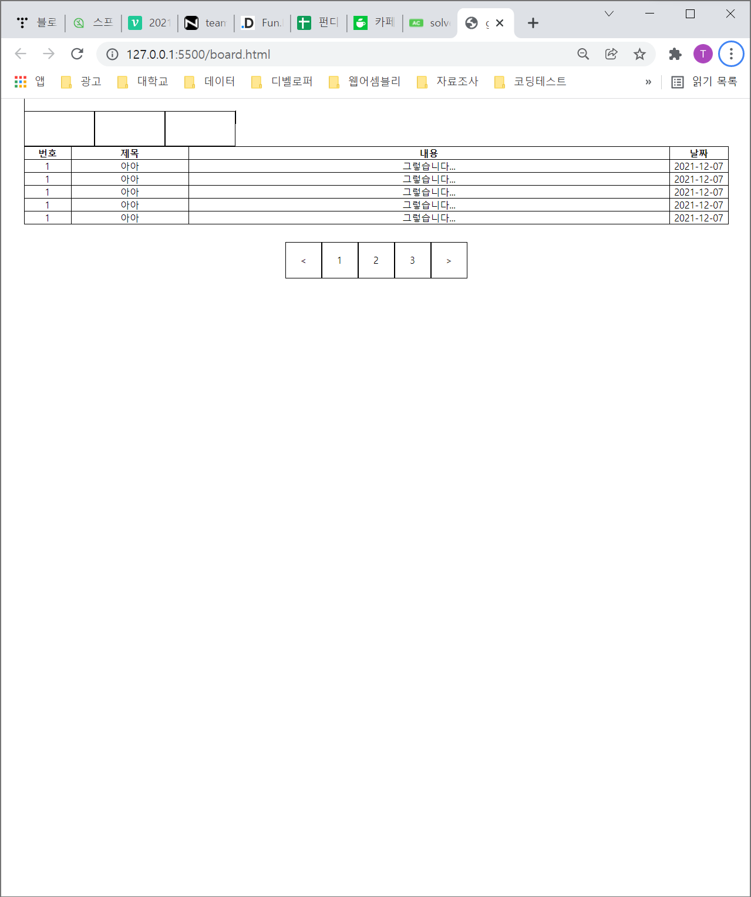

## 2021-12-13
### 2021-12-07 에 있었던 float에 대한 추가적인 공부

<br>

[12월 7일 포스트](https://github.com/Imaspear/Busan-Sturdy/blob/main/2021/12/2021-12-07.md)

<br>

## float:left로 인해 스타일이 깨지는 경우
---
 1. float:left를 사용하려는 영역의 상위 영역에서 inline을 사용하는 경우
    
    해당 영역에 들어가지 않는다.

    


 2. float:left를 사용하려는 영역의 상위 영역에서 block을 사용하는 경우

    해당 영역에 들어가지 않는다.

    


<br>
<br>

## 아래의 이미지와 같이 스타일이 깨지지 않기 위해 float을 해제해야 한다.


<br>
<br>
<br>

## float:left 해제하는 방법
---
### 1. float:left를 사용하려는 영역의 상위 영역에서 inline-block을 사용하는 경우
inline-block 속성이 부여된 요소는 자식들의 높이만큼 높이가 늘어난다. 하지만 IE6~7버전의 브라우저는 100%너비를 갖는 경우도 있으니 너비의 값도 지정해줘야 한다.


### 2. style:after{...}

상위 영역에서 flaot를 해제하는 방법이 존재한다. clear 속성을 이용해 float를 해제할 수 있다.

```css
    .nav::after{
        content: '';
        display: block;
        clear: both;
        height: 0;
        visibility: hidden;
}


```

### 3. overflow:hidden or auto
overflow:hidden 또는 auto 속성을 주면서 overflow하는 것을 막아 float이 되는 속성들을 강제적으로 다시 감싸게 된다. 이 속성을 float을 다시 감싸기 위해 남발한다면 스크롤 속도를 느리게 만든다. 

> 이 떄 중요한 점은 블록 레벨 컨테이너 높이를 설정하거나 white-space:nowrap 속성을 적용해야 한다.