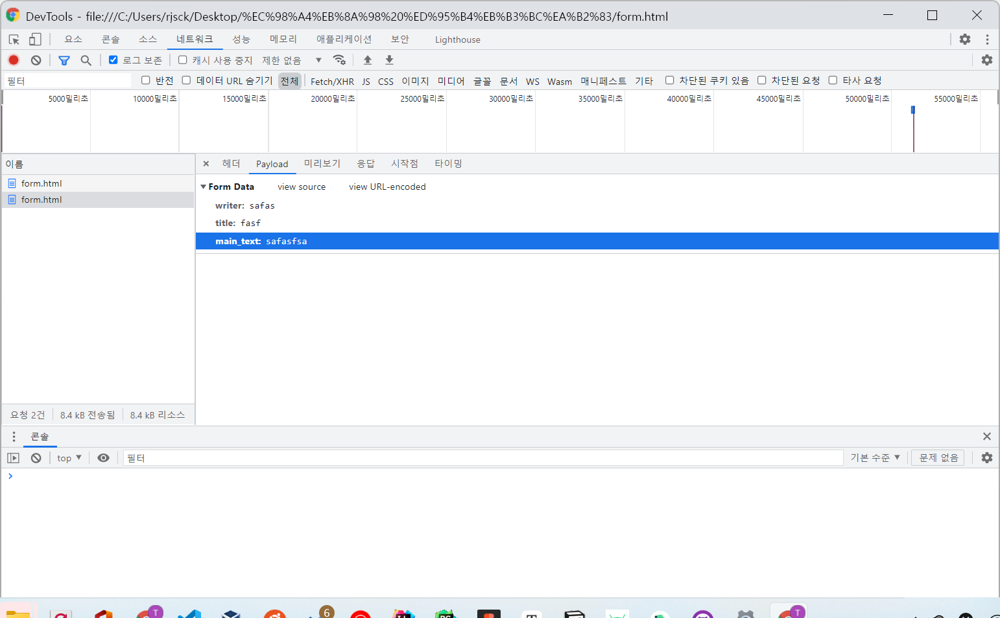

## 2021-12-14 화요일 스터디

### 데이터가 영역 밖으로 나오지 않게 하기

overflow: hidden; 속성은 넓이를 주면 해당 넓이만큼만 보여주고 나머지는 자르는 역할을 한다. 하지만 해당 영역에 넓이가 존재하지 않으면, 자식의 넓이만큼 커진다. 
text-overflow: ellipsis; 속성을 주면 텍스트가 잘릴 때, 마지막에 "..." 텍스트를 주는 속성이다. 데이터베이스에서 로드할 때, 특정 영역만큼 가져와도 넘치는 것을 생각해 스타일에서 한 번 더 설정한다면, 웹 페이지가 깨지지 않게 만들 수 있을 것 같다.

```css
.class{
    overflow: hidden;
    text-overflow: ellipsis;
}
```

### white-space 를 잘 활용하자!

사용자가 직접 공백을 많이 작성했을 경우도 많다. 이 때 컴퓨터는 공백을 인식하지 않고, 다음 텍스트가 나올 때까지 텍스트를 가져온다. 

만약 white-space: nowrap;을 주지 않는다면 우리의 컴퓨터는 다음 공백을 제외한 제한 영역만큼의 텍스트를 가져와 화면을 깨지게 하는 대참사를 불러올 수 있다.

```css
.class{
    white-space: nowrap;
}
```

### [webkit-line-clamp]( https://developer.mozilla.org/ko/docs/Web/CSS/-webkit-line-clamp )
white-space: nowrap;와 사용하는 속성이다. 이 속성은 추후에 따로 작성하겠다.


### type = "reset"
type = "reset" 은 폼 태그 안에 있는 글들을 reset 해주는 역할을 한다. 해당 HTML에 있는 모든 form 들을 초기화 하지 않고, reset 버튼이 들어가 있는
form 영역 안의 input 태그들이 초기화 된다. 여기서 중요한 부분은 **지워는게 아니라 초기화 되는 것이다.** 기본 value 값이 적용된 input 태그는 기본 value 값으로 초기화 되고, 
radio 타입의 input 태그에서는 초기 checked 속성을 적용했던 값으로 돌아간다.


### Get? Post?
#### get 방식
get 방식은 서버에서 데이터를 조회하기 위해 만들어진 메서드이다. get 메서드는 데이터를 http 리스폰스의 헤더에 넣어서 보낸다.
1. post 방식 보다 빠르다.
    get을 이용해 파라미터로 보내면  쿼리 스트링 한계에 부딪힌다. 보통 URL의 최대 길이가 2048자이기 때문에 게시글 데이터를 보내기에는 모자란 단점이 있다.

#### post 방식
post는 리소스를 생성 및 변경하기 위해 만들어진 메서드이다. post 메서드는 데이터를 http 리스폰스의 바디에 넣어 보낸다.
1. get 방식과 달리 문자 길이 제한이 없어 대용량의 데이터를 전송할 수 있다.
2. http 응답 바디에 들어가기 때문에 get 방식보다 보안성이 뛰어나다.

#### 구글 콘솔에서 post로 보낸 데이터를 확인해보자


아래는 get 데이터를 쿼리 매개변수로 보는 방법이 적힌 문서를 링크했다. get 요청을 할 때, 개발자 도구를 이용해 파라미터를 확인하면 헤더에 어떤 파라미터가 들어가는지 정확하게 확인할 수 있다.
#### [get 데이터를 쿼리 매개변수로 보는 방법](https://developer.chrome.com/docs/devtools/network/reference/?utm_source=devtools#query-string)


### PHP
오늘 처음으로 PHP를 사용해봤다. 이전 스프링을 공부하면서 *'왜 이 소프트웨어가 탄생하게 된거지?'* 라는 질문을 통해 소프트웨어의 장점을 알게 되면 소프트웨어의 활용도를 높일 수 있다는 교휸을 얻었기에 PHP를 왜 사용하는지 알아보기로 했다.

처음 PHP는 일종의 프레임워크인 줄 알았는데 프로그밍 언어였다. 객체 지향 프로그래밍과, 절처적 프로그래밍의 패러다임에 영향을 받았지만, 아직 내가 사용하는 데에 미숙함이 있어서 그런지 절차적 프로그래밍에 가까워 보였다.

나는 PHP의 장점을 알아보니 PHP가 등장하기 전의 언어들에 비해 '직관적'이라는 장점이 있다는 것이다. 실제로 오늘 사용해보니 따로 요청을 할 필요 없이 HTML 마크업언어에 동적인 페이지를 만들 수 있다는 장점이 있었다. 어쩌면 PHP는 인터프리터를 지원하는 언어이기에 매우 직관적이라고 생각이 들었다. 

PHP를 이용해 만들어진 코드이그나이트를 사용하는데 코드이그나이트틑 MVC 모델을 추구했다. MVC 모델을 추구하면 자동적으로 객체 지향적인 설계를 하게 될거라고 생각을 하고 있고, PHP를 이용해 객체 지향적인 설계를 할 수 있겠다는 생각에 심장이 떨린다...!! 😊😊

#### 우선 PHP를 이용해 정적인 HTML을 동적인 페이지로 만드는 방법이다.

```php
<?php for ($i=0; $i < 9; $i++) { ?> 
        <tr>
            <td><?= $i ?></td>
            <td><p class="title">title</p></td>
            <td class="desc"><p>content</p></td>
            <td>date</td>
        </tr>                        
<?php } ?>
```
코드이그나이트를 이용해 PHP 명령어를 보면 PHP 명령어를 수행하면서 HTML 페이지를 출력했다.

#### php의 표현식
우선 제일 직관적인 표현은 아래의 코드였다. 정말 간단했고, 이 단어 하나만으로 단일 책임을 가지고 있고, 의존성 주입을 하고 있다는 생각을 통해 객체 지향적으로 설계할 수 있겠다는 생각을 했다.

```php
<?= $i ?>
```

### bitnami를 이용하자
우리 스터디는 bitnami라는 오픈 소스를 이용해 서버를 구축하고, 배포하는 방법을 선택했다. 간단하게 들은 바로는 bitnami 오픈 소스안에 웹 배포에 필요한 소프트웨어가 다 설치되어 있어서 매우 간편하다는 것을 알았다. 하지만 나는 공부를하고 있는 bitnami에 대해 혼자 공부하는 시간을 가졌다. 지금은 README.txt 를 읽고 있지만 나중에 [공식 문서](https://bitnami.com)를 읽어 봐야겠다.

나는 최신 버전인 bitnami 버전은 8.1.0-0 을 선택했고, 이 버전 안에 포함되어 있는 소프트웨어의 버전들이다. 
#### bitnami안에 포한되는 팩 버전
- Apache 2.4.51
- MariaDB 10.4.22
- PHP 8.1.0
- PHPMyAdmin 5.1.1
- ImageMagick 7.0.7-11
- SQLite 3.37.0
- ModSecurity 2.9.3
- Git 2.34.0


마지막 웹 배포에 필요한 컴포넌트로는 아래 웹 프레임워크를 선택했다.
- CodeIgniter 4.1.5

bitnami는 MySql 서버도 직접 설치해주기 때문에 따로 설정할 필요가 없어 매우 편리했다. 하지만 확장하려면 많이 힘들지 않을까 우려가 들었다. 이렇게 한 군데에 설치하는 방법과 다 방면으로 관리하는 방법을 동시에 해보려고 한다. 우선은 한 곳에 다 설치해 배포하는 것을 우선으로 웹 페이지를 제작 해보겠다.


### codeigniter
코드이그나이터는 MVC 모델이라는 것을 알았다. 그 외에 다양한 서비스들은 데이터베이스를 설정해보고 찾아 봐야겠다. 

[공식문서](http://www.ciboard.co.kr/user_guide/kr/general/welcome.html)

