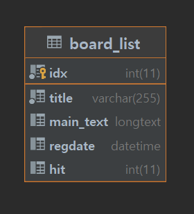

## 2021-12-22 화요일 스터디

### 테이블 생성

#### 기본적인 테이블 생성

임시적으로 테스트할 테이블을 생성해 화면에 가져왔다. 



#### 테이블안에서 입력되는 날자를 생성하는게 나을까 PHP 내에서 입력하는 날자를 저장하는게 나을까?

게시판을 만드는 시점에서 나는 생각하기 나름이라 말하고 싶다.
왜냐하면 DB 서버 안에서 날짜를 저장하면 WAS 서버나 네트워크 트래픽을 조금이라도 줄일 수 있겠지만, 저장하는 시점을 어떻게 잡냐에 따라 설정하는 방법을 달리했다.

사용자가 게시판을 작성하고 생성일자를 볼 수 있도록 만든 컬럼인데 DB에서 바로 저장 되지 않아 딜레이가 되어서 DATE가 늦게 지정된다면 이 것 또한 데이터에 대한 신뢰성이 떨어지는 부분이다.

그래서 나는 WAS 서버 내에서 버튼을 클릭했을 시점을 게시판 CREATE-DATE나 EDIT-DATE라 생각을 하고 클릭했을때를 기준으로 했다.

#### HIT 수는 함수를 이용해서 올릴까?

FUNCTION을 이용해 DB내에서 하나의 로우가 조회될 때마다 COUNT += 1 해주는 것을 함수를 이용해 제공할 수 있지 않을까 생각을 했다.

USER가 정의하는 FUNCTION의 특징은 리턴값이 존재하고, DB 객체로 저장되어 컴파일 된 상태에서 수행한다는 점과 단독적인 사용보다 SQL에서 많이 사용한 다는 점이다. 특히나 예외 처리가 가능해서 데이터를 조금 더 객체화 할 수 있지 않을까 해서 생각해낸 방법이다.

이렇게 되면 WAS 서버와 네트워크 부하를 더 줄일 수 있다고 생각을 했다.
DB 서버에서 네트워크 통신을 이용해 많은 데이터가 교류하는데, 컬럼 아이템 하나를 줄이면 WAS 서버와 네트워크의 트래픽을 줄이지 않을까

물론 DB 서버에서 FUNCTION 사용이 과도하게 증가할 경우 CPU 사용률을 높이는 비효율이 발생하기 때문에 HIT 수를 증가시키는 함수를 생성했을때, 효율적인지를 확인해볼 필요가 있다.

### MySQL을 이용해 데이터 가져오기

```php
    $mysql_hostname = 'localhost';//localhost
    $mysql_username = 'root';//root
    $mysql_password = '112100';
    $mysql_database = 'board';//testdb
    
    $connect = mysqli_connect($mysql_hostname, $mysql_username, $mysql_password, $mysql_database);
    $regdate = date('y-m-d', time());
    $sql = "INSERT INTO BOARD_LIST(TITLE, MAIN_TEXT, REGDATE) VALUES('$title', '$main_text', '$regdate')";
    $result=mysqli_query($connect,$sql);
   
```

#### 어떻게 하면 PHP 페이지들을 직관적으로 볼 수 있을까?

수정하기 전 페이지
select.php
```php
<?php

    $mysql_hostname = 'localhost';//localhost
    $mysql_username = 'root';//root
    $mysql_password = '112100';
    $mysql_database = 'board';//testdb

    $connect = mysqli_connect($mysql_hostname, $mysql_username, $mysql_password, $mysql_database);

    $sql = "SELECT * FROM BOARD_LIST";

    $result = mysqli_query($connect, $sql);
    include('./board.php');
?>
```

분할하려는 페이지
select.php
```php
<?php
    $mysql_hostname = 'localhost';//localhost
    $mysql_username = 'root';//root
    $mysql_password = '112100';
    $mysql_database = 'board';//testdb

    $connect = mysqli_connect($mysql_hostname, $mysql_username, $mysql_password, $mysql_database);
?>
```
connectingDB.php
```php
<?php
    include('./connectingDB.php');

    $sql = "SELECT * FROM BOARD_LIST";

    $result = mysqli_query($connect, $sql);
    include('./board.php');
?>
```

>하지만 코드이그나이트는 객체 지향적인 설계가 가능하다고 했다. 그럼 이 코드의 문제점은
>하나의 페이지에서 많은 의존성을 띄고 있다는 문제점과 함께 
>의존 역전의 원칙을 지킬 수 없고, 개방 폐쇄 원칙을 지킬 수 없다. 이 방법에 대해서는
>PHP에 대해 조금 더 사용해보고 좋은 객체 지향 설계를 토대로 공부를 해보자.


### PHP 화면에 가져오기

```php
                <?php $i=0; while($row = $result -> fetch_assoc()) { ?> 
                        <tr>
                            <td><?= ++$i ?></td>
                            <td><p class="title" style="cursor: pointer;" onclick="link(<?= $row['idx']?>)"><?= $row['title']?></p></td>
                            <td class="desc"><?= $row['main_text']?></td>
                            <td><?= date('y-m', strtotime($row['regdate']))?></td>
                        </tr>                        
                <?php } ?>
```

### 다량의 리스트로 가져올 떄는 어떤게 효율적인가? 

처음 이 코드를 보고 다량의 테스트 코드를 가져올 때, 어떤 방법이 효율적인가 생각을 했다.
그래서 PHP 스크립트에서 어떤 방식이 더 효율적인가 찾아본 결과 배열 값을 미리 계산해두지 않고 적은 for문이 가장 느렸고, 그다음 배열 값을 미리 정해둔 for문, 마지막으로 foreach문이 더 빨랐다.


[참고 블로그](https://blog.naver.com/PostView.naver?blogId=takane7&logNo=221435041152&parentCategoryNo=&categoryNo=&viewDate=&isShowPopularPosts=false&from=postView)

그래서 변경한 코드가 아래이다. 아직 ket를 이용하지 않았지만 key를 이용할 수 있지 않을까 해서 설정했다.
            
```php
                <?php $i=0; foreach ($result as $key => $element){ ?>
                    <tr>
                        <td><?= ++$i ?></td>
                        <td><p class="title" style="cursor: pointer;" onclick="link(<?= $element['idx']?>)"><?= $element['title']?></p></td>
                        <td class="desc"><?= $element['main_text']?></td>
                        <td><?= date('y-m', strtotime($element['regdate']))?></td>
                    </tr>
                <?php } ?>
```

### next...

#### 페이지네이션
다음은 페이지네이션에 대해 공부해볼 생각이다. 옛날에도 한 번 만들어본 적이 있지만, 
다시 만들 생각만 해도 기분이 새롭다.